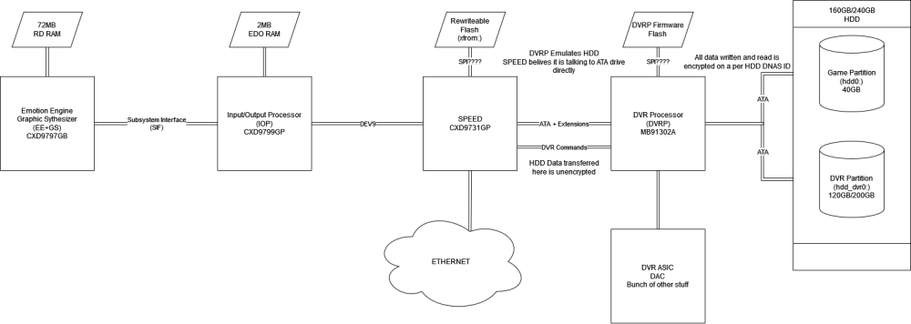

# DVRP
The DVRP is a co-processor within the PSX. It communicates to IOP as a gateway to access DVR functionality as well as reading and writing to the built in HDD. The DVRP is a Fujitsu MB91302A with a built-in mask rom configured by Sony at the factory (needs confirmation). The DVRP accepts update commands from the PSX update utility disks which suggests that the firmware is flashable in some way.

## Firmware
During a firmware upgrade for the DVRP, the IOP issues 4 types of commands over a bus [todo: Analyze IOP->DVRP communication]. A copy of this firmware exists in the `__system\xosd\packages\DVRP_FIRMWARE.udm` partition of `hdd0:` [needs verification]. The DVRP supports a microITRON RTOS, it is unclear if Sony used this in the DVRP but there are related strings within the on-disk firmware.


### Flash Commands
Commands are issued through `DVRDRV.irx`.
- `0x5114`: Signal beginning of flash operation. Provide firmware size and number of pages required to send entire firmware. DVRP responds confirming buffer is large enough to accept firmware.
- `0x5115`: Signal DVRP that a firmware page is loaded into the correct memory address[DMA? Register?] on the IOP, the index of the page, the offset of the data, and total page size.
- `0x5116`: Signal full firmware has been transferred. DVRP performs some kind of checksum and responds with a validation signal if valid.
- `0x5117`: Commits transferred firmware to the DVRP. [Todo: where is this written to? Does DVRP compress/encode/encrypt?]

## Architecture
The Fujitsu MB91302A is part of the FR60 family of chips. Fujitsu documents this as a unique Architecture from FR30, however the GCC compiler and RedBoot consider the MB91302A as a FR30 target.

## Memory Map
Reset Vector located at `0x000F_FFFC`. When DVRP starts the PC is set to this vector. This address space is within the Internal ROM, it is unclear where Internal ROM expects to jump into external Flash.

Registers `ASR`, `ACR` and `ASZ` are used to configure how access to External Area maps to the external address and data pins on the DVRP.

```
0x0000_0000 -> 0x0000_03FF Direct Addressing Area & IO
0x0000_0400 -> 0x0000_FFFF I-RAM
0x0001_0000 -> 0x0003_EFFF System Reserved
0x0003_F000 -> 0x0003_FFFF Internal RAM (4KiB)
0x0003_F000 -> 0x0003_FFFF Internal RAM (4KiB)
0x0004_0000 -> 0x000D_FFFF External Area
0x000E_0000 -> 0x000F_EFFF System Reserved
0x000F_F000 -> 0x000F_FFFF Internal ROM (Sony Mask rom?)
0x0010_0000 -> 0xFFFF_FFFF External Area (Flash Device?)
```

## Encryption
DVRP encrypts data on the fly when the IOP attempts to write to the disk. This encryption is determined by an ID on the harddrive. DVRP encrypts on a per-sector basis. Sectors that have not been written to are still nulled out (`0x00`);

[Sony ATA Security commands are documented in the ps2sdk](https://github.com/ps2dev/ps2sdk/blob/f4e8415ebd4146f414670150a92f472dca9ddba3/common/include/atahw.h#L139) It appears `ATA_SCE_IDENTIFY_DRIVE` is the only one used by the DVRP.

## Bus Diagram


## Useful links
[MB91302A Hardware manual](https://www.fujitsu.com/downloads/MICRO/fma/pdfmcu/hm91301CM71-10114-3E.pdf)

[Radare2 Modified to support FR30 disassembly](https://github.com/DiscoStarslayer/radare2/pull/1)

[Ghidra extension for a FR80 cpu](https://github.com/ammaraskar/ghidra-fujitsu-risc)

[Binutils FR30 Support](https://github.com/bminor/binutils-gdb/blob/master/opcodes%2Ffr30-opc.h)
[FR60 Disassembler](https://scratchpad.fandom.com/wiki/Disassemblers/DFR)
